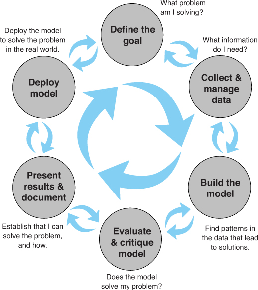
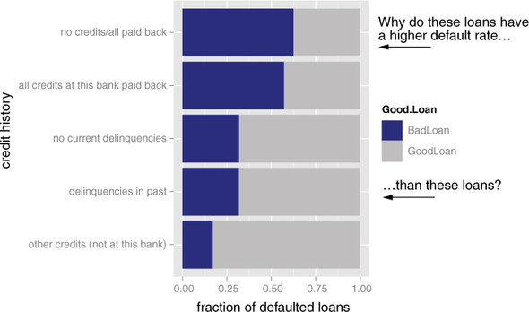
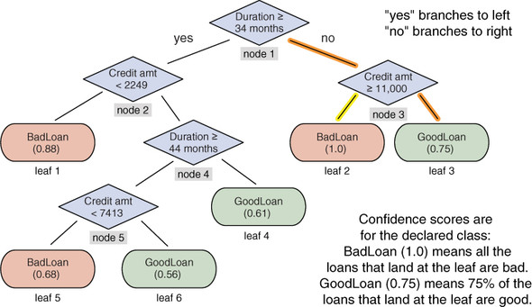
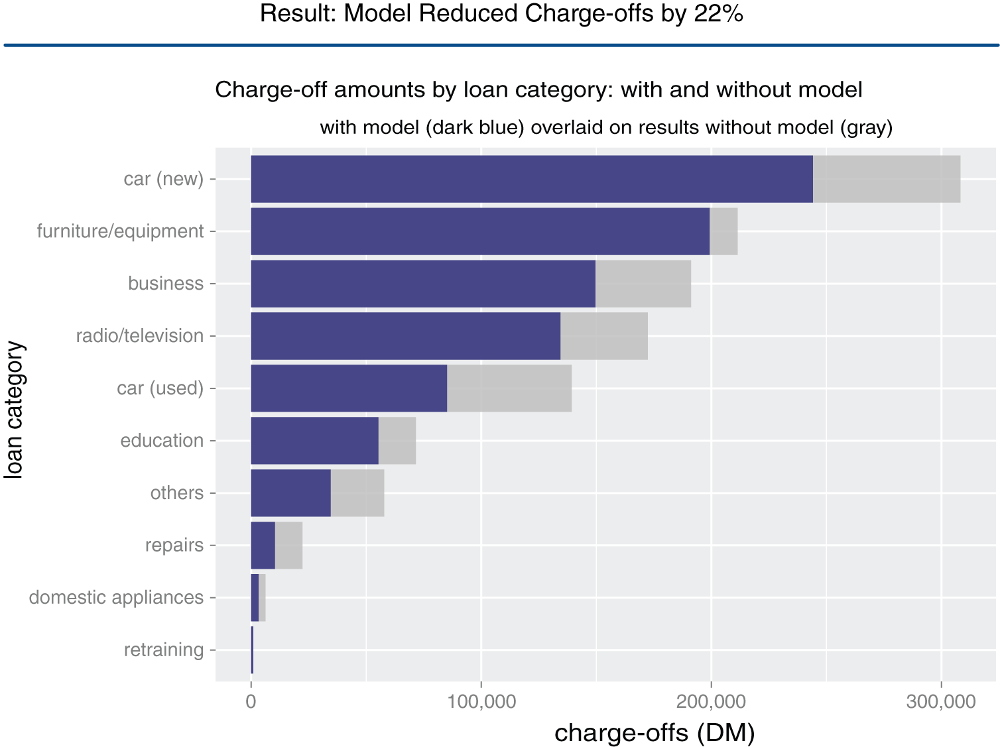

::::::::::::: {style="text-align: justify"}
<br>

<br>

<!-- ```{r setup, include = FALSE} -->

<!-- knitr::opts_chunk$set(warning = FALSE, echo = FALSE) -->

<!-- knitr::opts_chunk$set(warning = FALSE) -->

<!-- ``` -->

------------------------------------------------------------------------

> En este capítulo aprenderás sobre:
>
> -   La definición de ciencia de datos.
> -   La definición de roles en proyectos de ciencia de datos.
> -   Las etapas de un proyecto de ciencia de datos.
> -   Establecer expectativas para un nuevo proyecto de ciencia de datos.

------------------------------------------------------------------------

------------------------------------------------------------------------

<br>

## 1.1. Introducción

La ciencia de datos es una práctica multidisciplinaria que se basa en métodos de *ingeniería de datos*, *estadísticas descriptivas*, *minería de datos*, *aprendizaje automático* y *análisis predictivo*.

Al igual que la *investigación de operaciones*, la ciencia de datos se centra en **implementar decisiones basadas en datos y gestionar sus consecuencias**.

El científico de datos es responsable de guiar un proyecto de ciencia de datos de principio a fin. El éxito en un proyecto de ciencia de datos no proviene del acceso a una herramienta exótica, sino de:

-   Tener objetivos cuantificables.
-   Una buena metodología.
-   Interactuar entre disciplinas.
-   Diseñar e implementar un flujo de trabajo repetible.

Este capítulo muestra cómo se ve un proyecto típico de ciencia de datos, es decir, los tipos de problemas que encuentra, los tipos de objetivos que debe tener, las tareas que probablemente manejará y el tipo de resultados que se esperan.

<br>

Para motivar la discusión en este capítulo, usaremos un ejemplo concreto del mundo real.

::: {style="background-color: LightGray; padding: 20px; border-radius: 25px; opacity: 0.8"}
Suponga que, como científico de Datos, trabaja para un banco. El banco siente que está perdiendo demasiado dinero por préstamos incobrables y quiere reducir sus pérdidas. Para hacerlo, quieren una herramienta que ayude a los ejecutivos de crédito a detectar con mayor precisión los préstamos de riesgo.
:::

<br>

## 1.2. Los Roles en un Proyecto de Ciencia de Datos

La ciencia de datos es un esfuerzo colaborativo que se basa en una serie de roles, habilidades y herramientas. A continuación veremos cuáles son los roles más comunes que debiesen estar presentes en todo proyecto de ciencia de datos al interior de una organización.

### 1.2.1. Roles del Proyecto

Algunos de los roles recurrentes en un proyecto de ciencia de datos son los que se muestran en la siguiente tabla.

<br>

| Rol | Responsabilidades |
|:----------------:|:----------------------------------------------------:|
| Patrocinador del proyecto | Representa los intereses comerciales; defiende el proyecto |
| El cliente | Representa los intereses de los usuarios finales; experto en en el tema |
| Científico de datos | Establece y ejecuta la estrategia analítica; se comunica con el patrocinador y el cliente |
| Arquitecto de datos | Gestiona los datos y el almacenamiento de datos; a veces gestiona la recopilación de datos |
| Operaciones | Gestiona la infraestructura; despliega los resultados finales del proyecto |

<br>

A veces, estos roles pueden superponerse. Algunos roles, en particular, cliente, arquitecto de datos y operaciones, a menudo los ocupan personas que no están en el equipo del proyecto de ciencia de datos, pero que son colaboradores clave.

<br>

#### **Patrocinador del Proyecto**

El papel más importante en un proyecto de ciencia de datos es el patrocinador del proyecto. Es la persona que quiere el resultado de la ciencia de datos; generalmente, representan los intereses comerciales y es responsable de decidir si el proyecto es un éxito o un fracaso. Por lo tanto, obtener la aprobación del patrocinador se convierte en el objetivo organizativo central de un proyecto de ciencia de datos.

Para garantizar la aprobación del patrocinador es recomendable:

-   Realizar entrevistas dirigidas de modo de lograr obtener de el objetivos claros.
-   Capturar los objetivos como declaraciones cuantitativas.
-   Mantenerlo informado e involucrado mostrándole periódicamente planes, avances, y éxitos o fracasos intermedios en términos que pueda comprender.

Una buena forma de garantizar el fracaso del proyecto es mantener al patrocinador en la oscuridad.

<br>

::: {style="background-color: LightGray; padding: 20px; border-radius: 25px; opacity: 0.8"}
En el ejemplo de la solicitud de préstamo, el patrocinador podría ser el director de préstamos del banco, y su objetivo concreto y preciso podría ser Identificar el 90% de las cuentas que entrarán en mora al menos dos meses antes del primer pago atrasado con una tasa de falsos positivos de no más del 25%.

Este objetivo permite verificar si los resultados realmente van a tener sentido comercial y si se tienen datos y herramientas de calidad suficiente.
:::

<br>

#### **Cliente**

Si bien el patrocinador es el rol que representa los intereses comerciales, el cliente es el rol que representa los intereses de los usuarios finales del modelo. A veces, los roles de patrocinador y cliente pueden ser ocupados por la misma persona.

El cliente es más práctico que el patrocinador. No son necesariamente sofisticados desde el punto de vista matemático o estadístico, pero están familiarizados con los procesos comerciales relevantes y sirven como expertos en el dominio del equipo.

Al igual que con el patrocinador, debe mantener al cliente informado e involucrado. Es importante tener reuniones periódicas con ellos para mantener sus esfuerzos alineados con las necesidades de los usuarios finales, y tomar en serio sus críticas. Si los usuarios finales no pueden o no quieren usar su modelo, entonces el proyecto no será un éxito a largo plazo.

<br>

::: {style="background-color: LightGray; padding: 20px; border-radius: 25px; opacity: 0.8"}
En el ejemplo de solicitud de préstamo, el cliente puede ser un ejecutivo de crédito o alguien que represente los intereses de los ejecutivos de crédito.
:::

<br>

#### **Científico de Datos**

Es responsable de tomar todos los pasos necesarios para que el proyecto tenga éxito, incluido el establecimiento de la estrategia del proyecto y mantener informado al cliente.

Diseñan los pasos del proyecto, eligen las fuentes de datos y las herramientas que se utilizarán. Dado que eligen las técnicas que se probarán, deben estar bien informados sobre estadísticas y aprendizaje automático. También son responsables de la planificación y el seguimiento del proyecto, aunque pueden hacerlo con un socio de gestión del proyecto.

A un nivel más técnico, el científico de datos también analiza los datos, realiza pruebas y procedimientos estadísticos, aplica modelos de aprendizaje automático y evalúa los resultados, es decir, la parte científica de la ciencia de datos.

El científico de datos debe desarrollar una gran *empatía de dominio* para ayudar a definir y resolver los problemas correctos.

<br>

#### **Arquitecto de Datos**

Es responsable de todos los datos y su almacenamiento. A menudo, esta función la desempeña alguien fuera del grupo de ciencia de datos, como un administrador o arquitecto de bases de datos. Los arquitectos de datos a menudo administran almacenes de datos para muchos proyectos diferentes, y es posible que solo estén disponibles para consultas rápidas.

<br>

#### **Operaciones**

El rol de operaciones es fundamental tanto para adquirir datos como para entregar los resultados finales.

La persona que cumple este rol generalmente tiene responsabilidades operativas fuera del grupo de ciencia de datos. Por ejemplo, si está implementando un resultado de ciencia de datos que afecta cómo se clasifican los productos en un sitio de compras en línea, entonces la persona responsable de administrar el sitio tendrá mucho que decir sobre cómo se puede implementar tal cosa.

Es probable que esta persona ponga limitaciones en:

-   El tiempo de respuesta de los resultados del modelo una vez que esté operativo.
-   El lenguaje de programación que se puede usar.
-   La cantidad de datos que se deben usar durante la implementación.

<br>

## 1.3. Etapas de un Proyecto de Ciencia de Datos

El entorno ideal de ciencia de datos es aquel que fomenta la retroalimentación y la iteración entre el científico de datos y todas las demás partes interesadas.

Un modelo común del proceso de aprendizaje automático es el proceso estándar entre industrias para la minería de datos [(CRISP-DM)](https://es.wikipedia.org/wiki/Cross_Industry_Standard_Process_for_Data_Mining). El modelo que discutiremos aquí es similar, pero enfatiza que el intercambio es posible en cualquier etapa del proceso. En realidad los límites entre las etapas son fluidos y las actividades de una etapa a menudo se superponen a las de otras etapas. A menudo, se pasa de un lado a otro entre dos o más etapas antes de avanzar en el proceso general. Esto se muestra en la siguiente figura.

<br>

<center>{style="border-radius: 5px;"}</center>

<br>

Incluso después de completar un proyecto e implementar un modelo, pueden surgir nuevos problemas y preguntas al ver ese modelo en acción. El final de un proyecto puede dar lugar a un proyecto de seguimiento.

### 1.3.1. Definiendo el Objetivo

La primera tarea en un proyecto de ciencia de datos es **definir un objetivo medible y cuantificable**.

En esta etapa, aprenda todo lo que pueda sobre el contexto del proyecto:

-   ¿Por qué los patrocinadores quieren el proyecto en primer lugar? ¿Qué les falta y qué necesitan?
-   ¿Qué están haciendo para resolver el problema ahora y por qué no es lo suficientemente bueno?
-   ¿Qué recursos necesitará: qué tipo de datos y cuánto personal? ¿Tendrá expertos en el dominio con quienes colaborar y cuáles son los recursos computacionales?
-   ¿Cómo planean los patrocinadores del proyecto implementar sus resultados? ¿Cuáles son las limitaciones que deben cumplirse para una implementación exitosa?

<br>

::: {style="background-color: LightGray; padding: 20px; border-radius: 25px; opacity: 0.8"}
En el ejemplo de solicitud de préstamo, el objetivo comercial final es reducir las pérdidas del banco debido a préstamos incobrables. El patrocinador del proyecto requiere una herramienta para ayudar a los ejecutivos de préstamos a calificar con mayor precisión a los solicitantes de préstamos y así reducir la cantidad de préstamos incobrables. Al mismo tiempo, es importante que los ejecutivos de crédito sientan que tienen la decisión final sobre la aprobación del préstamo.
:::

<br>

Una vez que usted, el patrocinador del proyecto y otras partes interesadas hayan establecido respuestas preliminares a estas preguntas, usted y ellos pueden comenzar a definir el objetivo preciso del proyecto. El objetivo debe ser específico y medible; no "Queremos mejorar en la búsqueda de préstamos incobrables", sino "Queremos reducir nuestra tasa de cancelaciones de préstamos en al menos un 10%, utilizando un modelo que predice qué solicitantes de préstamos probablemente incurrirán en incumplimiento".

Un objetivo concreto conduce a condiciones de parada concretas y criterios de aceptación concretos. Cuanto menos específico sea el objetivo, más probable es que el proyecto no tenga límites, porque ningún resultado será "suficientemente bueno". Si no sabe lo que quiere lograr, no sabe cuándo dejar de intentarlo, ni siquiera qué intentar. Cuando el proyecto termine finalmente, porque se agote el tiempo o los recursos, nadie estará satisfecho con el resultado.

Por supuesto, en ocasiones existe la necesidad de proyectos más flexibles y exploratorios: "¿Hay algo en los datos que se correlacionen con valores predeterminados más altos?" o "¿Deberíamos pensar en reducir los tipos de préstamos que otorgamos? ¿Qué tipos podríamos eliminar? " En esta situación, aún puede definir el alcance del proyecto con condiciones de detención concretas, como un límite de tiempo. Por ejemplo, puede decidir dedicar dos semanas, y no más, a explorar los datos, con el objetivo de proponer hipótesis candidatas. Estas hipótesis se pueden convertir en preguntas u objetivos concretos para un proyecto de modelado a gran escala.

Una vez que tenga una buena idea de los objetivos del proyecto, puede concentrarse en recopilar datos para alcanzar esos objetivos.

### 1.3.2. Recopilación y Gestión de Datos

Este paso comprende identificar los datos que necesita, explorarlos y acondicionarlos para que sean adecuados para el análisis. Esta etapa es a menudo el paso más lento del proceso. También es uno de los más importantes.

Algunas preguntas importantes que hay que responder en esta etapa son las siguientes:

-   ¿Qué datos tengo a mi disposición?
-   ¿Me ayudará a resolver el problema?
-   ¿Son suficientes?
-   ¿Es la calidad de los datos lo suficientemente buena?

<br>

::: {style="background-color: LightGray; padding: 20px; border-radius: 25px; opacity: 0.8"}
En el ejemplo de solicitud de préstamo, imagine que ha recopilado una muestra de préstamos representativos de la última década. Algunos de los préstamos están en mora, sin embargo la mayoría de ellos (alrededor del 70%) no.

Los atributos/variables recopiladas sobre cada solicitud de préstamo son los siguientes:

1.  **Status_of_existing_checking_account** (al momento de solicitud).
2.  **Duration_in_month** (duración del préstamo).
3.  **Credit_history**.
4.  **Purpose** (para comprar auto, pagar estudios, etc.).
5.  **Credit_amount** (monto del préstamo).
6.  **Savings_Account_or_bonds** (balance/monto).
7.  **Present_employment_since**.
8.  **Income**.
9.  **Personal_status_and_sex**.
10. **Cosigners**.
11. **Present_residence_since**.
12. **Collateral** (es dueño de un auto, una propiedad, etc.).
13. **Age_in_years**.
14. **Other_installment_plans** (otros créditos/líneas de crédito).
15. **Housing** (dueño, arrienda, etc.).
16. **Number_of_existing_credits_at_this_bank**.
17. **Job** (tipo de empleo).
18. **Number_of_dependents**.
19. **Telephone**.
20. **Loan_status** (variable dependiente).

La variable **Loan_status** toma dos valores posibles: *GoodLoan* y *BadLoan*. Para los propósitos de esta discusión, suponga que un *GoodLoan* significa "crédito pagado" y un *BadLoan* "crédito no pagado".

En la medida de lo posible, intente utilizar información que pueda medirse directamente, en lugar de información que se infiera de otra medición. Por ejemplo, puede tener la tentación de utilizar **Income** como variable, con el razonamiento de que un ingreso más bajo implica más dificultades para pagar un préstamo. Sin embargo, la capacidad de pagar un préstamo se mide de manera más directa considerando el monto de los pagos del préstamo en relación con los ingresos disponibles del solicitante. Esta información es más útil que los ingresos por sí solos.
:::

<br>

Esta es la etapa en la que inicialmente explora y visualiza sus datos. También se limpian y reparan los errores, y se transforman las variables, según sea necesario. En este proceso de exploración y limpieza de los datos es posible que descubra que no son adecuados para su problema o que también necesita otro tipo de información. Adicionalmente, puede descubrir cosas en los datos que plantean problemas más importantes que el que originalmente planeaba abordar.

<br>

::: {style="background-color: LightGray; padding: 20px; border-radius: 25px; opacity: 0.8"}
<center>{style="border-radius: 5px;"}</center>

<br>

En el ejemplo de solicitud de préstamo, la información que muestra la figura anterior parece contradictoria.

¿Por qué algunos de los solicitantes aparentemente seguros (aquellos que históricamente pagaron todos los créditos al banco) incumplirían a una tasa más alta que los aparentemente más riesgosos (aquellos que habían estado en mora en el pasado)?

Después de analizar más detenidamente los datos y compartir hallazgos desconcertantes con otras partes interesadas y expertos en el tema, se da cuenta de que esta muestra está intrínsecamente sesgada: solo tiene préstamos que fueron aprobados (y, por lo tanto, ya se aceptaron). Una muestra verdaderamente imparcial de solicitudes de préstamos debe incluir tanto las solicitudes de préstamo aceptadas como las rechazadas.

En general, debido a que su muestra solo incluye préstamos aceptados, hay menos préstamos de apariencia riesgosa que préstamos de apariencia segura. La historia probable es que los préstamos de apariencia arriesgada se aprobaron después de un proceso de investigación mucho más estricto, un proceso que quizás las solicitudes de préstamos de apariencia segura podrían eludir.

Esto sugiere que si su modelo se va a utilizar después del proceso de aprobación de la solicitud actual, el historial crediticio ya no es una variable útil. También sugiere que incluso las solicitudes de préstamos aparentemente seguras deberían examinarse más detenidamente.
:::

<br>

Descubrimientos como este pueden llevarlo a usted y a otras partes interesadas a cambiar o refinar los objetivos del proyecto. En este caso, puede decidir concentrarse en las solicitudes de préstamos aparentemente seguras. Es común alternar entre esta etapa y la anterior, así como entre esta etapa y la etapa de modelado, a medida que descubre cosas en los datos.

### 1.3.3. Modelado

Finalmente, se llega a las estadísticas y al aprendizaje automático durante la etapa de modelado o análisis.

Aquí es donde intenta extraer información útil de los datos para lograr sus objetivos. Dado que muchos procedimientos de modelado hacen suposiciones específicas sobre la distribución de datos y las relaciones, puede haber superposición y un intercambio entre la etapa de modelado y la etapa de limpieza de datos a medida que intenta encontrar la mejor manera de representar los datos y la mejor forma en que modelarlo.

Las tareas de modelado de ciencia de datos más comunes son las siguientes:

-   **Clasificación**: decidir si algo pertenece a una categoría u otra
-   **Regresión**: predecir o estimar un valor numérico, como un precio o una probabilidad
-   **Ranking**: aprender a ordenar artículos por preferencias
-   **Agrupación**: ordenamiento de elementos en grupos similares
-   **Encontrar relaciones**: encontrar correlaciones o posibles causas de los efectos observados en los datos.
-   **Caracterización**: gráficas muy generales y generación de informes a partir de datos

<br>

::: {style="background-color: LightGray; padding: 20px; border-radius: 25px; opacity: 0.8"}
<center>{style="border-radius: 5px;"}</center>

<br>

En el ejemplo de solicitud de préstamo, lo que se tiene es un problema de clasificación: se desea identificar a los solicitantes de préstamos que probablemente incurran en incumplimiento. Algunos enfoques comunes en tales casos son la regresión logística y los métodos basados en árboles de decisión.

De conversaciones con los ejecutivos de crédito y otras personas que usarían su modelo usted se da cuenta que ellos quieren llegar a comprender la cadena de razonamiento detrás de los resultados del modelo, y quieren también una indicación de cuán seguro este es. En efecto, quieren responder ¿Es muy probable que este solicitante incumpla, o solo es algo probable?

Para resolver este problema, usted decide que un árbol de decisiones es el modelo más adecuado, llegando a obtener lo que que se muestra en la figura de arriba.

Veamos cómo su modelo puede responder las preguntas planteadas. Para esto, tracemos una ruta de ejemplo a través del árbol:

Supongamos que existe una solicitud para un préstamo a un año de 10.000 dólares. En la parte superior del árbol (nodo 1 en la figura), el modelo verifica si el préstamo es por más de 34 meses. La respuesta es "no", por lo que el modelo toma la rama derecha del árbol. La siguiente pregunta (nodo 3) es si el préstamo es por más de 11.000 dólares. Nuevamente, la respuesta es "no", por lo que el modelo se bifurca a la derecha y llega a la hoja 3. Históricamente, el 75% de los préstamos que llegan a esta hoja son buenos préstamos, por lo que el modelo recomienda que se apruebe este préstamo, ya que existe una alta probabilidad de que sea pagado.

Por otro lado, suponga que hay una solicitud de préstamo a un año de 15.000 dólares. En este caso, el modelo se ramificaría primero a la derecha en el nodo 1, y luego a la izquierda en el nodo 3, para llegar a la hoja 2. Históricamente, todos los préstamos que llegan a la hoja 2 han incumplido, por lo que el modelo recomienda que rechace esta solicitud de préstamo.
:::

<br>

### 1.3.4. Evaluación y Crítica de Modelos

Una vez que tenga un modelo, debe determinar si cumple con sus objetivos. Para esto, algunas de las preguntas que debiese hacerse son las siguientes:

-   ¿Es lo suficientemente preciso para las necesidades? ¿Generaliza bien?
-   ¿Funciona mejor que "la suposición obvia"? ¿Mejor que cualquier estimación que se utilice actualmente?
-   ¿Tienen sentido los resultados del modelo (coeficientes, grupos, reglas, intervalos de confianza, significados y diagnósticos) en el contexto del dominio del problema?

Si respondió "no" a alguna de estas preguntas, es hora de volver al paso de modelado o decidir que los datos no respaldan el objetivo que está tratando de lograr. Comprender cuándo no puede cumplir con sus criterios de éxito con los recursos actuales le ahorrará esfuerzos infructuosos. Esto puede significar definir objetivos más realistas o recopilar los datos adicionales u otros recursos que necesita para lograr sus objetivos originales.

<br>

::: {style="background-color: LightGray; padding: 20px; border-radius: 25px; opacity: 0.8"}
En el ejemplo de la solicitud de préstamo, lo primero que hay que comprobar es si las reglas que descubrió el modelo tienen sentido.

Al observar la figura del modelo de árbol de decisión que creó, no nota ninguna regla obviamente extraña, por lo que puede seguir adelante y evaluar la precisión del modelo.

Un buen resumen de la performance de un modelo de clasificación es la [**matriz de confusión**](https://es.wikipedia.org/wiki/Matriz_de_confusi%C3%B3n#:~:text=En%20el%20campo%20de%20la,se%20emplea%20en%20aprendizaje%20supervisado.), la cual tabula las clasificaciones reales con las predichas.

De acuerdo con los datos que se tienen, la matiz de confusión para el modelo de árbol de decisión creado es la siguiente:

``` {style="padding: 20px; border-radius: 25px; opacity: 0.8"}
##                    pred
##   actual     BadLoan GoodLoan
##   BadLoan       41      259
##   GoodLoan      13      687
```

donde las columnas hacen referencia a las predicciones mientras que las filas a las clases reales. En efecto, se puede apreciar por ejemplo que el modelo predice que 41 solicitudes son predichas correctamente como *BadLoan* mientras que 259 son predichas como *GoodLoan* siendo que en realidad son *BadLoan*.

En una matriz de confusión la diagonal muestra, para cada clase, la cantidad de predicciones correctas realizadas por el modelo, mientras que los elementos fuera de la diagonal corresponden a la cantidad de predicciones incorrectas para cada una de las clases presentes.

A partir de la matriz anterior, se pueden calcular distintas métricas que revelan el poder predictivo del modelo. Entre éstas, se pueden mencionar las siguientes:

1.  [**Accuracy**](https://es.wikipedia.org/wiki/Precisi%C3%B3n_y_exactitud) (AC): es la proporción del número total de predicciones correctas. En nuestro ejemplo se tiene

    $$
    AC = \frac{41 + 687}{41 + 687 + 259 + 13} = 0.728
    $$

2.  [**Precision**](https://en.wikipedia.org/wiki/Positive_and_negative_predictive_values) (P): es la proporción de casos predichos *BadLoan* que fueron correctamente identificados. En nuestro ejemplo se tiene

    $$
    P = \frac{41}{41 + 13} = 0.7592
    $$

3.  [**Recall o True Positive Rate**](https://es.wikipedia.org/wiki/Precisi%C3%B3n_y_exhaustividad) (TPR): es la proporción de casos reales *BadLoan* que se identificaron correctamente como *BadLoan*. En nuestro ejemplo se tiene

    $$
    TPR = \frac{41}{41 + 259} = 0.1367
    $$

4.  [**False Positive Rate**](https://en.wikipedia.org/wiki/False_positive_rate) (FPR): es la proporción de casos reales *GoodLoan* que se identificaron incorrectamente como *BadLoan*. En nuestro ejemplo se tiene

    $$
    FPR = \frac{13}{13 + 687} = 0.1857
    $$

De las métricas anteriores se puede observar que el modelo predijo correctamente el estado del préstamo el 73% de las veces. Sin embargo, en el conjunto de datos original, el 30% de los préstamos eran malos, por lo que "adivinar" *GoodLoan* correspondería a un 70% en este caso. En conclusión, el modelo funciona mejor que el azar, pero solo un poco mejor!

En general, usar la métrica *Accuracy* no es suficiente. Si se quiere saber qué tipo de errores se están cometiendo, hay que poner atención a las otras métricas. Por ejemplo, *Recall* mide cuántos de los préstamos incobrables puede correctamente predecir el modelo. *Precision* mide cuántos de los préstamos identificados como malos son realmente malos. *False Positive Rate* mide cuántos de los préstamos buenos se identifican erróneamente como malos. Idealmente, se busca que *Recall* y *Precision* sean altas y que *False Positive Rate* sea baja. Lo que constituye "suficientemente alto" y "suficientemente bajo" es una decisión que toma junto con los demás interesados.
:::

<br>

### 1.3.5. Presentación y Documentación

Una vez que tenga un modelo que cumpla con sus criterios de éxito, debe presentar los resultados al patrocinador del proyecto y a otras partes interesadas. También es requisito documentar el modelo para aquellos en la organización que son responsables de usar, ejecutar y mantenerlo una vez que se haya implementado.

Las diferentes audiencias requieren diferentes tipos de información. Por ejemplo, las audiencias orientadas a los negocios quieren comprender el impacto de sus hallazgos en términos de métricas comerciales.

<br>

::: {style="background-color: LightGray; padding: 20px; border-radius: 25px; opacity: 0.8"}
En el ejemplo de la solicitud de préstamo, lo más importante que debe presentar al público empresarial es cómo el modelo de solicitud de préstamo reducirá los no pagos (el dinero que el banco pierde por préstamos incobrables). Así, si el modelo identifica un conjunto de préstamos incobrables que representan el 22% del dinero total perdido por incumplimiento, la presentación o resumen ejecutivo debe enfatizar que el modelo puede potencialmente reducir las pérdidas del banco en esa cantidad, tal como se muestra en la figura.

<br>

<center>{style="border-radius: 5px;" width="590"}</center>

<br>

También puede ser interesante brindarle a este tipo de audiencia hallazgos o recomendaciones más interesantes, como que los préstamos para automóviles nuevos son mucho más riesgosos que los préstamos para automóviles usados, o que la mayoría de las pérdidas están relacionadas con préstamos para automóviles incobrables y préstamos para equipos defectuosos (suponiendo que la audiencia no ya conozco estos hechos).

Detalles técnicos del modelo no serán tan interesantes para esta audiencia, y debe omitirlos o solo presentarlos de manera general.
:::

<br>

Por otro lado en cambio, para los usuarios finales del modelo (los ejecutivos de crédito) debiese enfatizar en cómo el modelo los ayudará a hacer mejor su trabajo, es decir:

-   ¿Cómo deben interpretar el modelo?

-   ¿Cómo se ve la salida del modelo?

-   Si el modelo proporciona un rastro de qué reglas en el árbol de decisión se ejecutaron, ¿cómo lo leen?

-   Si el modelo proporciona una puntuación de confianza además de una clasificación, ¿cómo deberían utilizar la puntuación de confianza?

-   ¿Cuándo podrían potencialmente no hacerle caso al modelo?

Finalmente, las presentaciones o la documentación para el personal de operaciones deben enfatizar el impacto del modelo en los recursos que ellos son responsables.

### 1.3.6. Implementación y Mantenimiento de Modelos

En muchas organizaciones cuando el modelo es puesto en producción, significa que el científico de datos ya no tiene la responsabilidad principal del funcionamiento diario de este. Sin embargo, debe asegurarse de que el modelo funcione sin problemas y no tome decisiones desastrosas sin supervisión.

También debe asegurarse de que el modelo se pueda actualizar a medida que cambia su entorno. Y en muchas situaciones, el modelo se implementará inicialmente en un pequeño programa piloto. La prueba puede revelar problemas que no anticipó y es posible que deba ajustar el modelo en consecuencia.

<br>

## 1.4. Establecer Expectativas

Establecer expectativas es una parte crucial para definir los objetivos del proyecto y los criterios de éxito.

Los miembros del equipo orientados al negocio (en particular, el patrocinador del proyecto) probablemente ya tengan una idea del desempeño requerido para cumplir los objetivos comerciales: por ejemplo, el banco quiere reducir sus pérdidas por préstamos incobrables en al menos un 10%.

Antes de profundizar demasiado en un proyecto, debe asegurarse de que los recursos que tiene sean suficientes para alcanzar los objetivos comerciales. Para esto, es indispensable llegar a conocer bien los datos, lo cual ocurre durante la fase de exploración y limpieza. Así, una vez que tenga una idea de los datos, puede tener una idea de si éstos son lo suficientemente buenos para cumplir con los umbrales de rendimiento deseados. Si no es así, tendrá que volver a revisar el diseño del proyecto y la etapa de establecimiento de objetivos.

### 1.4.1. Determinación de Límites Inferiores en el Rendimiento del Modelo

Comprender qué tan bien debería funcionar un modelo para un rendimiento aceptable es importante al definir los criterios de aceptación.

El **modelo nulo** representa el límite inferior del rendimiento del modelo por el que debe esforzarse. Puede pensar en el modelo nulo como el "desde", es decir, su modelo debe funcionar mejor que este.

-   En situaciones en las que ya existe un modelo de trabajo o una solución que está tratando de mejorar, el modelo nulo es la solución existente.

-   En situaciones en las que no existe un modelo o solución, el modelo nulo es el modelo más simple posible.

<br>

::: {style="background-color: LightGray; padding: 20px; border-radius: 25px; opacity: 0.8"}
En nuestro ejemplo de solicitud de préstamo, el 70% de las solicitudes de préstamo del conjunto de datos resultaron ser buenos préstamos. Un modelo que etiquete todos los préstamos como *GoodLoan* (de hecho, utilizando solo el proceso existente para clasificar los préstamos) sería correcto el 70% de las veces. Por lo tanto, sabe que cualquier modelo real que ajuste a los datos debería tener una precisión superior al 70% para ser útil, si la precisión fuera su única métrica. Dado que este es el modelo más simple posible, su tasa de error se denomina tasa de error base.
:::

<br>

¿Cuánto mejor que el 70% debería ser? En estadística, existe un procedimiento llamado [**prueba de hipótesis**](https://es.wikipedia.org/wiki/Contraste_de_hip%C3%B3tesis), o prueba de significancia, que prueba si su modelo es equivalente a un modelo nulo (en nuestro caso, si un nuevo modelo es básicamente tan preciso como adivinar *GoodLoan* todo el tiempo).
:::::::::::::
