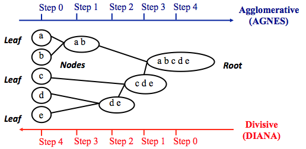
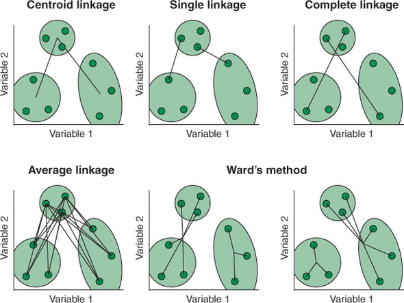

<div style="text-align: justify">

<br>

<br>

```{r setup, include = FALSE}
knitr::opts_chunk$set(warning = FALSE, echo = TRUE)
knitr::opts_chunk$set(warning = FALSE)
```

```{r , include = FALSE}
# load(file = "CAP6_Global_Environment.RData")
```


------------------------------------------------------------------------

> **En este capítulo aprenderás sobre:**
>
> 1.  El aprendizaje no-supervisado y los tipos de tareas que se pueden abordar con este tipo de aprendizaje automático.
> 2.  Cómo medir (di)similitud entre observaciones.
> 3.  El algoritmo `k-means` y cómo implementarlo usando la librería `cluster` de `R`.
> 4.  El algoritmo de conglomerados jerárgico y cómo implementarlo usando la librería `hclust` de `R`.
> 5.  Cómo determinar la cantidad óptima de conglomerados para ambos algoritmos.

------------------------------------------------------------------------

<br>

# 1. Introducción
Se dice que un algoritmo de aprendizaje automático **no está supervisado** si el algoritmo no utiliza una variable respuesta que contiene los resultados verdaderos de cada observación (verdad fundamental o _ground truth_) y, en cambio, busca por sí solo patrones en los datos que insinúen alguna estructura subyacente. Es decir, ya no se depende de los datos etiquetados para aprender patrones de los datos.

Debido a que ya no se tiene una variable respuesta con la que comparar las predicciones realizadas por el algoritmo, validar el desempeño de los modelos de aprendizaje automático sin supervisión puede ser un desafío y puede que no siempre haya una respuesta obvia o incluso "correcta". Sin embargo, existen formas prácticas de garantizar el mejor desempeño posible de éstos.

<br>

::: {style="background-color: LightGray; padding: 20px; border-radius: 25px; opacity: 0.8"}
Por ejemplo, digamos que se tienen datos de expresión génica de muchas biopsias cancerosas y entrenamos un algoritmo para determinar si es posible encontrar similitudes entre éstas. 

Una manera de lograr el objetivo es agrupando aquellos puntos de datos que son similares entre sí, es decir, generando _clusters_ o conglomerados de datos. Este tipo de análisis puede revelar si existen subgrupos de tipos de cáncer que es posible que deban ser tratados de manera diferente.

::: 

<br>

Los algoritmos de aprendizaje automático no supervisados también se pueden dividir en dos clases:

-   Los algoritmos de [**reducción de dimensionalidad**](): toman datos sin etiquetar (porque son métodos de aprendizaje no supervisados) y datos de alta dimensión (datos con muchas variables) y aprenden una forma de representarlos en un número menor de dimensiones. Los algoritmos de reducción de dimensiones se pueden usar como una técnica exploratoria (porque es muy difícil para los humanos interpretar visualmente los datos en más de dos o tres dimensiones a la vez) o como un paso de preprocesamiento en la canalización de aprendizaje automático (puede ayudar a mitigar problemas como colinealidad y la maldición de la dimensionalidad, términos que definiré en capítulos posteriores). Los algoritmos de reducción de dimensiones también se pueden utilizar para ayudar a confirmar visualmente el rendimiento de los algoritmos de clasificación y agrupamiento (permitiéndo trazar los datos en dos o tres dimensiones).

-   Los algoritmos de [**agrupamiento**](): toman datos sin etiquetar y aprenden patrones de agrupamiento en los datos. Un grupo es una colección de observaciones que son más similares entre sí que a puntos de datos en otros grupos. El supuesto en el que se basa este tipo de técnicas es que las observaciones en el mismo grupo comparten algunas características unificadoras que las hacen identificablemente diferentes de otros grupos. Los algoritmos de agrupamiento pueden usarse como una técnica exploratoria para comprender la estructura de nuestros datos y pueden indicar una estructura de agrupamiento que se puede incorporar a los algoritmos de clasificación.

Decidir qué clase de algoritmo elegir suele ser sencillo:

-   Si necesita representar la información de muchas variables con menos variables, use la reducción de dimensión.

-   Si necesita identificar grupos de casos, utilice un algoritmo de agrupamiento.


Conceptualmente, el agrupamiento puede considerarse similar a la clasificación, en el sentido de que se está tratando de asignar un valor discreto a cada caso. La diferencia es que mientras que la clasificación usa casos etiquetados para aprender patrones en los datos que separan las clases, la agrupación se usaa cuando no hay ningún conocimiento previo sobre la pertenencia a clases o si existen clases distintas en los datos. La agrupación, por lo tanto, describe un conjunto de algoritmos que intentan identificar una estructura de agrupación dentro de un conjunto de datos.

<br>

# 2. Análisis de conglomerados `k-means`
Al agrupar observaciones se quiere que, las observaciones en el mismo grupo sean similares y que las observaciones en diferentes grupos sean diferentes. 

Debido a que no hay una variable de respuesta, es necesario encontrar relaciones de **similitud** entre las observaciones para así poder clasificarlas. La agrupación en clústeres de [**k-means**]() es el método de agrupación en clúster más simple y más utilizado para dividir un conjunto de datos en un conjunto de `k` grupos.

## 2.1. Preparación de los datos
Para realizar un análisis de conglomerados es necesario que los datos deban prepararse de la siguiente manera:

1. Las filas son observaciones y las columnas son variables.
2. Cualquier valor que falte en los datos debe eliminarse o estimarse.
3. Los datos deben estar estandarizados para que las variables sean comparables, es decir, las variables son transformadas de tal manera que tengan media cero y desviación estándar uno. Así, si $x_{i}$ es una observación de la variable $x$, $\bar{x}$ es su media, y $sd(x)$ su desviación estándar, la transformación puede ser expresada por:

$$
z_{i} = \frac{x_{i} - \bar{x}}{sd(x)}.
$$

Básicamente, esta preparación tiene que ver con dejar todas las variables en una misma escala ya que, debido a que los algoritmos de `k-means` usan una métrica de distancia para asignar casos a grupos, es importante que las variables en diferentes escalas tengan el mismo peso. 

## 2.2. Medidas de distancia o de (di)similaridad
Clasificar las observaciones en grupos requiere algunos métodos para calcular la distancia o la (di)similitud entre cada par de observaciones. El resultado de este cálculo se conoce como [**matriz de disimilitud**]() o [**matriz de distancia**](). 

Hay muchos métodos para calcular esta información de distancia; la elección de medidas de distancia es un paso crítico en la agrupación ya que define cómo se calcula la similitud de dos elementos $(x, y)$ e influirá en la forma quee tengan finalmente los grupos. Los métodos clásicos para medir la distancia son:

-   Distancia [Euclidiana]():

$$
d_{euc}(x,y) = \sqrt{\sum_{i=1}^n(x_i - y_i)^2}.
$$

-   Distancia de [Manhattan]():

$$
d_{man}(x,y) = \sum_{i=1}^n |x_i - y_i|.
$$

En general, la medida de distancia usada por defecto en la mayoría de las librerías es la distancia euclidiana. Sin embargo, según el tipo de datos y las preguntas que se quieran responder, es posible que sea necesario usar [otras medidas de disimilitud]().

Existen otras medidas de disimilitud, como las distancias basadas en correlación. La distancia basada en la correlación se define restando a $1$ el coeficiente de correlación. Se pueden utilizar diferentes tipos de métodos de correlación como:

-   Distancia basada en [correlación de Pearson]():

$$
d_{cor}(x,y) = 1 - \frac{\sum_{i = 1}^n (x_i - \bar{x})(y_i - \bar{y})}{\sqrt{\sum_{i = 1}^n (x_i - \bar{x})^2 \sum_{i = 1}^n (y_i - \bar{y})^2}}.
$$

-   Distancia basada en [correlación de Spearman](): calcula la correlación entre el rango de $x$ ($x'_{i} = rank(x_{i})$) y el rango de las variables $y$ ($y'_{i} = rank(y_{i})$. En efecto:

$$
d_{spear}(x,y) = 1 - \frac{\sum_{i = 1}^n (x'_i - \bar{x'})(y'_i - \bar{y'})}{\sqrt{\sum_{i = 1}^n (x'_i - \bar{x'})^2 \sum_{i = 1}^n (y'_i - \bar{y'})^2}},
$$

-   Distancia basada en [correlación de Kendall](): mide la correspondencia entre la clasificación de las variables $x$ e $y$. El número total de posibles emparejamientos de observaciones $x$ con $y$ es $n(n - 1)/2$, donde $n$ es el tamaño de $x$ e $y$. Se comienza ordenando los pares por los valores de $x$. Si $x$ e $y$ están correlacionados, entonces tendrían los mismos órdenes de rango relativo. Ahora, para cada $y_{i}$, cuente el número de $y_{j} > y_{i}$ (pares concordantes, $c$) y el número de $y_{j} < y_{i}$ (pares discordantes, $d$), así:


$$
d_{kend}(x,y) = 1 - \frac{n_{c} - n_{d}}{\frac{1}{2} n(n - 1)}.
$$

## 2.3. La idea
Agrupar en clústeres usando el algoritmo `k-mean` consiste en dividir un conjunto de datos determinado en un conjunto de `k` grupos (es decir, `k` clústeres), donde `k` representa la cantidad de grupos preespecificados por el analista, de modo que los objetos dentro del mismo clúster son lo más similares posible (es decir, alta similitud intraclase), mientras que los objetos de diferentes clústeres son lo más diferentes posible (es decir, baja similitud inter-clase).

En la agrupación de `k-means`, cada grupo está representado por su centro (llamado centroide) que corresponde a la media de puntos asignados al grupo.

La idea básica detrás del agrupamiento consiste en definir grupos de modo que se minimice la **variación total dentro del grupo** (conocida como _total within-cluster variation_). Hay varios algoritmos de `k-means` [disponibles](), aquí usaremos el algoritmo estándar de `Hartigan-Wong`, que define la variación total dentro del conglomerado como la suma de las distancias euclidianas cuadradas entre los elementos y el centroide correspondiente, es decir:

$$
W(C_k) = \sum_{x_i \in c_k} (x_i - \mu_k)^2,
$$

donde $x_{i}$ es un punto (observación) pertenenciente al cluster $C_{k}$ y $\mu_{k}$ es el valor medio de los puntos (observaciones) asignados al cluster $C_{k}$. Así, cada observación $x_{i}$ se asigna a un grupo dado de modo que la suma de cuadrados de la distancia de la observación a sus centros de grupo se minimiza.

La variación total dentro del conglomerado se define de la siguiente manera:

$$
\begin{array}{ll}
wws = \sum_{j = 1}^k W(C_k) \\
\ \ \ \ \ \ \ \ = \sum_{j = 1}^k \sum_{x_i \in C_j} (x_i - \mu_j)^2.
\end{array}
$$
La suma del cuadrado total dentro del grupo mide la **compacidad** (es decir, la bondad) del agrupamiento y lo que se busca es que sea lo más pequeña posible, es decir:

$$
minimize(wss).
$$

## 2.4. El algoritmo
El primer paso al utilizar la agrupación de `k-means` es indicar el número de agrupaciones (`k`) que se generarán en la solución final. El algoritmo comienza seleccionando aleatoriamente `k` objetos del conjunto de datos para que sirvan como centros iniciales para los grupos. Los objetos seleccionados también se conocen como medias de clúster o centroides. A continuación, cada uno de los objetos restantes se asigna a su centroide más cercano, donde más cercano se define utilizando la distancia euclidiana entre el objeto y la media del grupo. Este paso se denomina "paso de asignación de grupos". Después del paso de asignación, el algoritmo calcula el nuevo valor medio de cada grupo. El término "actualización del centroide" del clúster se utiliza para diseñar este paso. Ahora que se han recalculado los centros, se vuelve a comprobar cada observación para ver si podría estar más cerca de un grupo diferente. Todos los objetos se reasignan nuevamente utilizando los medios de clúster actualizados. Los pasos de actualización de centroide y asignación de conglomerados se repiten iterativamente hasta que las asignaciones de conglomerados dejan de cambiar (es decir, hasta que se logra la convergencia).

El algoritmo de `k-means` se puede resumir de la siguiente manera:

1. Especifique el número de clusters `k` que se crearán.
2. Seleccione aleatoriamente `k` objetos del conjunto de datos como centros o medias del grupo inicial.
3. Asigne cada observación a su centroide más cercano, según la distancia euclidiana entre el objeto y el centroide.
4. Para cada uno de los `k` conglomerados, actualice el centroide del conglomerado calculando los nuevos valores medios de todos los puntos de datos del conglomerado. El centroide del `k-ésimo` grupo es un vector de longitud `p` que contiene las medias de todas las variables para las observaciones en el grupo `k`; `p` es el número de variables.
5. Minimice iterativamente la variación total dentro del conglomerado (*total within-cluster variation*). Es decir, repita los pasos 3 y 4 hasta que las asignaciones de clúster dejen de cambiar o se alcance el número máximo de iteraciones.

## 2.4. Determinación de la cantidad óptima de clústers
En este algoritmo, la cantidad de clústers `k` debe ser predefinida _a priori_ por el analista. Cuando se tiene información y conocimiento profundo sobre el problema abordado, elejir este número puede llegar a ser relativamente sencillo. Sin embargo, cuando cuando no hay información externa, este número deberá ser buscado mediante algún método de optimización. 

Los tres métodos más populares para determinar el número óptimo de clústeres son:

**Método del codo** ([*Elbow Method*]()): para minimizar la variación total dentro del clúster mediante este método, se debe:

-   Ejecutar el algoritmo de agrupación en clústeres (`k-means`) para diferentes valores de `k`. Por ejemplo, variando `k` de 1 a 10 grupos.
-   Calcular los wss para cada `k`.
-   Graficar la curva de wss en función del número de grupos `k`.
-   El número apropiado de agrupaciones será aquel en el cual la curva graficada muestre una forma de "codo", es decir, cuando el wss empiece a variar (disminuir) más lentamente a medidaa que aumenta el número de grupos `k`.

<br>

**Método de silueta promedio** ([*Average Silhouette Method*]()): en términos simples, este enfoque mide la calidad de un agrupamiento. Es decir, determina qué tan bien se encuentra cada objeto dentro de su grupo. Un ancho de silueta medio alto indica una buena agrupación. Este método calcula la silueta promedio de las observaciones para diferentes valores de `k`, y el número óptimo de conglomerados `k` es el que maximiza la silueta promedio en un rango de valores posibles para `k`.

<br>

**Estadística de brecha** ([*Gap Statistic*]()): este enfoque se puede aplicar a cualquier método de agrupación (es decir, agrupación de `k-means`, agrupación jerárquica), y compara la variación intragrupo total para diferentes valores de `k` con sus valores esperados bajo una distribución de referencia nula de los datos (es decir, una distribución sin agrupamiento obvio). El conjunto de datos de referencia se genera utilizando simulaciones de Monte Carlo del proceso de muestreo. Es decir, para cada variable $x_{i}$ en el conjunto de datos se calcula su rango $[\min(x_{i}), \max(x_{i})]$ y generar valores para los $n$ puntos uniformemente desde el intervalo mínimo al máximo. Para los datos observados y los datos de referencia, la variación intragrupo total se calcula utilizando diferentes valores de `k`. El estadístico de brecha para un `k` dado se define de la siguiente manera:

$$
Gap_{n}(k) = E_{n}^* log(W_{k}) - log(W_{k}),
$$

donde $E_{n}^*$ denota la expectativa bajo un tamaño de muestra $n$ de la distribución de referencia. $E_{n}^*$ se define mediante bootstrapping generando $B$ copias de los conjuntos de datos de referencia y calculando el logaritmo promedio ($log(W_{k})$). El estadístico de brecha mide la desviación del valor $W_k$ observado de su valor esperado bajo la hipótesis nula. La estimación de los conglomerados óptimos $\hat{k}$ será el valor que maximice $Gap_{n}(k)$. Esto significa que la estructura de agrupamiento está lejos de la distribución uniforme de puntos.

En resumen, el algoritmo implica los siguientes pasos:

-   Agrupe los datos observados, variando el número de grupos de $k = 1, \cdots, k_{max}$, y calcule el $W_k$ correspondiente.
-   Genere $B$ conjuntos de datos de referencia y agrupe cada uno de ellos con un número variable de grupos $k = 1, \cdots, k_{max}$. Calcule las estadísticas de brecha estimadas.
-   Sea $w = \frac{1}{B} \sum_b log(W_{kb}^*)$, calcule la desviación estándar $sd(k) = \sqrt{\frac{1}{b}\sum_b (log(W_{kb}^*) - w)^2}$ y defina $s_k = sd_k \times \sqrt{1 + \frac{1}{B}}$.
-   Elija el número de clústeres como el más pequeño `k` tal que $Gap(k) \geq Gap(k + 1) - s_{k+1}$.

Tal como veremos a continuación, los tres métodos anteriores pueden ser implementados directamente en `R` a través de funciones especiales ya definidas en las librerías `factoextra` y `cluster`. 

## 2.5. Ventajas y desventajas
Los puntos fuertes de la agrupación de `k-means` son los siguientes:

-   Las observaciones pueden moverse entre grupos en cada iteración hasta que se encuentre un resultado estable.
-   Puede ser más rápido de calcular que otros algoritmos cuando hay muchas variables.
-   Es bastante sencillo de implementar.

Las debilidades de la agrupación en clústeres de `k-means` son las siguientes:

-   No puede manejar variables categóricas de forma nativa. Esto se debe a que calcular la distancia euclidiana en un espacio de variables categóricas no tiene sentido.
-   No puede seleccionar el número óptimo de clústeres.
-   Es sensible a los datos en diferentes escalas.
-   Debido a la aleatoriedad de los centroides iniciales, los conglomerados pueden variar ligeramente entre ejecuciones distintas.
-   Es sensible a los valores atípicos.
-   Preferiblemente encuentra grupos esféricos de igual diámetro, incluso si los datos subyacentes no se ajustan a esta descripción.

## 2.6. Implementación usando `R`
Para implementar el algoritmo de `k-means` en `R` usaremos las  librerías `cluster` y `factoextra`. Adicionalmente, usaremos la base de datos `USArrests.csv`, que contiene estadísticas sobre arrestos (por cada 100000 residentes) por asalto, asesinato y violación en cada uno de los 50 estados de EE.UU. en 1973, e incluye el porcentaje de la población que vive en áreas urbanas.

```{r message=FALSE, warning=FALSE, paged.print=TRUE}
library(cluster)
library(factoextra)

USArrests_data <- read.csv("USArrests.csv", stringsAsFactors = FALSE)
USArrests_data
```

Tal como se aprecia de la tabla anterior, el dataframe contiene 5 columnas y 50 observaciones. Note que la primera columna tiene por nombre `X`, esto es debido a que en el archivo original esa columna no estaba etiquetada, por lo que al cargarlaa con `read.csv()` se le asignó un nonbre por defecto. Dado que el algoritmo de `k-means` requiere que las variables sean numéricas (ya que usa la distancia como medida de (di)similitud), dejaremos los de la primera columna como nombres de fila, así no perderemos la información que está ahí (los nombres de los 50 estados de USA) y podremos sin problemas trabajar con el algoritmo de `k-means`. En efecto:

```{r}
rownames(USArrests_data) <- USArrests_data$X

USArrests_data <- USArrests_data[, -1]
USArrests_data
```

Usamos la función `str()` para inspeccionar las variables y hacernos una idea de los tipos de datos y valores que contienen:

```{r}
str(USArrests_data)
```

Aparentemente las cuatro variables ccontienen datos "sanos", sin embargo, debemos trasnformarlas de modo que todas ellas estén en una escala equivalente. Para eso, usamos la función `scale()`, tal como se observa a continuación:

```{r}
USArrests_scaled_data <- scale(USArrests_data, center = TRUE, scale = TRUE)
head(USArrests_scaled_data)
attributes(USArrests_scaled_data)[3:4]
```

Notar que la salida de la función `scale()` es una matriz que tiene dos atributos (meta data); `scaled:center` y `scaled:scale`. La primera corresponde a la media de cada variable en el dataframe original, y es usada para centrar la distibución, mientras que la segunda es la desviación estandar de cada variable en el dataframe original, y es usada para escalar la distribución. 

Una vez se tienen escaladas las variables, calculamos las distancias euclidianas entre ellas. Para esto, usamos la función `get_dist()` de la librería `factoextra`. Adicionalmente, mediante la función `fviz_dist()` de la misma librería podemos visualizar tales distancias, tal como se muestra a continuación:

```{r}
distance <- get_dist(x = USArrests_scaled_data,
                     method = "euclidean")

fviz_dist(dist.obj = distance, 
          gradient = list(low = "red", mid = "white", high = "blue"))
```

En el gráfico anterior, el color azul representa distancias grandes entre pares de observaciones, mientras que el color rojo representa lo contrario. Así, por ejemplo, podría decirse que `Vermont` y `California` están muy alejados (son muy disimiles) por lo que debiesen estar en conglomerados distintos, mientras que `Illinois` con `New York` son muy similares (y debiesen estar dentro del mismo grupo) ya que la distancia entre ellos es muy pequeña.

Si bien la gráfica anterior nos permite observar la (di)similitud entre los distintas pares de observaciones, no es práctica para determinar fácilmente los grupos y sus elementos. Es por eso que es necesario ejecutar un algoritmo de agrupamiento. En efecto, usaremos la función `kmeans()` de la librería `stats`, inicialmente considerando dos centros (es decir, dos grupos) y 25 observaciones:

```{r}
model_k2 <- kmeans(x = USArrests_scaled_data, 
                   centers = 2, 
                   nstart = 25)
str(model_k2)
```

De la salida anterior se observa que el algoritmo genera una lista de 9 elementos, entre los cuales están:

-   `cluster`: entrega el grupo al cual pertenece una observación.
-   `centers`: matriz con las coordenadas de los centros de los clúster, en el espacio de dimensiones igual al del número de variables consideradas (tener en cuenta que este espacio es el transformado, es decir, aquel obtenido luego de centrar y escalar las variables, por lo que si se quisiera volver al espacio de variables original, habría que aplicar la transformación inversa a estos valores).
-   `totss`: suma total de cuadrados.
-   `withinss`: vector de suma de cuadrados dentro del grupo, un componente por grupo.
-   `tot.withinss`: suma total de cuadrados dentro del conglomerado, es decir, `sum(withinss)`.
-   `betweenss`: suma de cuadrados entre grupos, es decir, $totss - tot.withinss$.
-   `tsize`: número de observaciones en cada grupo.

Al imprimir `model_k2` vemos que las agrupaciones dieron como resultado 2 clusters de tamaños 30 y 20. También obtenemos la asignación de grupo para cada observación (es decir, `Alabama` se asignó al grupo 2, `Arkansas` se asignó al grupo 1, etc.).

```{r}
model_k2
```

Notar que, tal como se había previsto, `Vermont` y `California` quedaron en conglomerados distintos, mientras que `Illinois` y `New York` quedaron en el mismo. Para ver los grupos y sus elementos, podemos usar la función `fviz_cluster()` de la librería `factoextra`. En efecto:

```{r}
fviz_cluster(object = model_k2, 
             data = USArrests_scaled_data)
```

Notar que los ejes no corresponden a ninguna de las variables originales (`Murder`, `Assault`, `UrbanPop`, `Rape`), si no que más bien a las dos componentes principales que explican la mayor cantidad de variavilidad en los datos (`fviz_cluster()` hace automáticcamente un análisis de PCA).

Para visualizar los grupos en términos de las variables originales, es necesario agregar al dataframe la asignación de clusters. En efecto, para `UrbanPop` en función de `Murder` se obtendrá:

```{r}
states_names <- rownames(USArrests_scaled_data)

x <- data.frame(USArrests_scaled_data,
                State = states_names,
                cluster = model_k2$cluster)

ggplot(data = x) +
    aes(x = UrbanPop, y = Murder, color = factor(cluster), label = State) +
    geom_text()
```

Debido a que el número de conglomerados `k` debe establecerse antes de iniciar el algoritmo, a menudo es ventajoso utilizar varios valores diferentes de `k` y examinar las diferencias en los resultados. Podemos ejecutar el mismo proceso para 3, 4 y 5 clústeres, y los resultados se muestran en la figura:

```{r}
model_k3 <- kmeans(x = USArrests_scaled_data, 
                   centers = 3, 
                   nstart = 25)

model_k4 <- kmeans(x = USArrests_scaled_data, 
                   centers = 4, 
                   nstart = 25)

model_k5 <- kmeans(x = USArrests_scaled_data, 
                   centers = 5, 
                   nstart = 25)

# plots to compare
p1 <- fviz_cluster(object = model_k2, 
                   geom = "point", 
                   data = USArrests_scaled_data) + 
    ggtitle("k = 2")

p2 <- fviz_cluster(object = model_k3, 
                   geom = "point",  
                   data = USArrests_scaled_data) + 
    ggtitle("k = 3")

p3 <- fviz_cluster(object = model_k4, 
                   geom = "point",  
                   data = USArrests_scaled_data) + 
    ggtitle("k = 4")

p4 <- fviz_cluster(object = model_k5, 
                   geom = "point",  
                   data = USArrests_scaled_data) + 
    ggtitle("k = 5")

library(gridExtra)
grid.arrange(p1, p2, p3, p4, 
             nrow = 2)
```

Aunque esta evaluación visual nos dice dónde ocurren las diluciones verdaderas (o no ocurren, como los grupos 2 y 4 en el gráfico `k = 5`) entre grupos, no nos dice cuál es el número óptimo de grupos. 

A continuación usaremos los tres métodos descritos anteriormente para encontrar el `k` óptimo. Por un lado, para el método del codo, usamos la función `fviz_nbclust()` de la librería `factoextra`, agregando el argumento `method = "wss"`. Es decir:

```{r}
set.seed(135)

fviz_nbclust(x = USArrests_scaled_data, 
             FUNcluster = kmeans, 
             method = "wss")
```

De la gráfica anterior se puede observar que el valor para `k` óptimo es 4 o 6. Veamos que obtenemos usando el método de la silueta:

```{r}
fviz_nbclust(x = USArrests_scaled_data, 
             FUNcluster = kmeans, 
             method = "silhouette")
```

Aquí obtenemos que el número óptimo de clusters debería ser 2. Probemos ahora usando el método del _Gap Statistics_. Para esto, usamos la funcción `clusGap()` de la librería `cluster`, considerando 50 datasets de referencia y como máximo 10 conglomerados:

```{r}
set.seed(123)
gap_stat <- clusGap(x = USArrests_scaled_data, 
                    FUNcluster = kmeans, 
                    nstart = 25,
                    K.max = 10, 
                    B = 50)

print(gap_stat, method = "firstmax")
fviz_gap_stat(gap_stat, maxSE = list(method = "firstmax", SE.factor = 1))
```

Este método nos dice que el número óptimo de grupos debe ser `k = 4`. En consecuencia, generamos el modelo óptimo usando este valor:

```{r}
# Compute k-means clustering with k = 4
set.seed(123)
best_model <- kmeans(USArrests_scaled_data, centers = 4, nstart = 25)
print(best_model)
```

Una visualización de este agrupamiento final (y las observaciones en cada grupo), se muestra a continuación:

```{r}
fviz_cluster(object = best_model, 
             data = USArrests_scaled_data)
```

Finalmente, agregamos la asignación de cada grupo al dataframe original y graficamos los perfiles de densidad para cada una de las variables, agrupadas por el cluster al que pertenecen las observaciones:

```{r}
USArrests_data$Cluster <- as.factor(best_model$cluster)
USArrests_data

ggplot(data = USArrests_data) + 
  aes(x = Murder, color = Cluster, fill = Cluster) + 
  geom_density(alpha = 0.3) + 
  theme_light()

ggplot(data = USArrests_data) + 
  aes(x = Assault, color = Cluster, fill = Cluster) + 
  geom_density(alpha = 0.3) + 
  theme_light()

ggplot(data = USArrests_data) + 
  aes(x = UrbanPop, color = Cluster, fill = Cluster) + 
  geom_density(alpha = 0.3) + 
  theme_light()

ggplot(data = USArrests_data) + 
  aes(x = Rape, color = Cluster, fill = Cluster) + 
  geom_density(alpha = 0.3) + 
  theme_light()
  
```

Si filtramos por cada uno de los grupos, podemos obtener sus medidas de tendencia central usando la función `summary()`, de modo de poder interpretar cuantitativamente las similitudes de cada observación en cada grupo, y las diferencias entre grupos respecto a las variables consideradas en el análisis:

```{r}
cluster_1 <- USArrests_data[USArrests_data$Cluster == 1, ]
cluster_1
summary(cluster_1[, -5])

cluster_2 <- USArrests_data[USArrests_data$Cluster == 2, ]
cluster_2
summary(cluster_2[, -5])

cluster_3 <- USArrests_data[USArrests_data$Cluster == 3, ]
cluster_3
summary(cluster_3[, -5])

cluster_4 <- USArrests_data[USArrests_data$Cluster == 4, ]
cluster_4
summary(cluster_4[, -5])
```

<br>

# 3. Análisis de conglomerados jerárquicos
El agrupamiento jerárquico es un enfoque alternativo al agrupamiento de `k-means` para identificar grupos en el conjunto de datos. No requiere que pre-especifiquemos el número de clústeres que se generarán como lo requiere el enfoque `k-means`. Además, la agrupación jerárquica tiene una ventaja adicional sobre la agrupación `k-means` en que da como resultado una representación atractiva de las observaciones basada en estructuras tipo árbol, llamada [dendrograma]().

La agrupación jerárquica en clústeres adopta un enfoque diferente y, como sugiere su nombre, puede aprender una jerarquía de clústeres de un conjunto de datos. Es decir, en lugar de obtener una salida “plana” de clústeres, el agrupamiento jerárquico da un árbol de clústeres dentro de los clústeres. Por lo tanto, como resultado, la agrupación jerárquica proporciona más información sobre las estructuras de agrupación complejas en comparación con los métodos de agrupación plana como `k-means`.

Se puede decir entonces que:

-   El propósito de los algoritmos de agrupamiento jerárquico es aprender la jerarquía de grupos en un conjunto de datos.
-   El principal beneficio de la agrupación jerárquica (comparado con `k-means`) es que se obtien una comprensión mucho más detallada de la estructura de los datos.

## 3.1. Preparación de los datos
Al igual que con el método de `k-means`, el análisis de agrupamiento jerárquico también es sensible a las diferencias entre las escalas para distintas variables (como lo es cualquier algoritmo que se base en la distancia entre variables continuas), por lo que los datos deban prepararse de la siguiente manera:

1. Las filas son observaciones y las columnas son variables.
2. Cualquier valor que falte en los datos debe eliminarse o estimarse.
3. Los datos deben estar estandarizados para que las variables sean comparables, es decir, las variables son transformadas de tal manera que tengan media cero y desviación estándar uno. Así, si $x_{i}$ es una observación de la variable $x$, $\bar{x}$ es su media, y $sd(x)$ su desviación estándar, la transformación puede ser expresada por:

$$
z_{i} = \frac{x_{i} - \bar{x}}{sd(x)}.
$$


## 3.2. El algoritmo
El agrupamiento jerárquico se puede dividir en dos tipos principales: aglomerativo y divisivo.

**Agrupación aglomerativa:** también se conoce como AGNES (anidamiento aglomerativo o _Agglomerative Nesting_) y funciona de forma ascendente. Es decir, cada objeto se considera inicialmente como un grupo de un solo elemento (hoja). En cada paso del algoritmo, los dos grupos que son más similares se combinan en un nuevo grupo más grande (nodos). Este procedimiento se repite hasta que todos los puntos son miembros de un solo gran clúster (raíz) (consulte la figura siguiente). El resultado es un árbol que se puede trazar como un dendrograma.

**Agrupación jerárquica divisiva:** también se conoce como DIANA (análisis de división o _Divise Analysis_) y funciona de forma descendente (al contrario que AGNES). Es decir, comienza con la raíz, en la que todos los objetos se incluyen en un solo clúster. En cada paso de la iteración, el grupo más heterogéneo se divide en dos. El proceso se repite hasta que todos los objetos están en su propio clúster.

En la siguiente figura se muestra una representación de los algoritmos descritos anteriormente.

<br>
<center>



</center>
<br>

Tenga en cuenta que la agrupación aglomerativa es buena para identificar agrupaciones pequeñas. La agrupación jerárquica divisiva es buena para identificar agrupaciones grandes.

## 3.3. Medidas de (di)similitud entre clusters
Como se vió en el caso de `k-means`, la (di)similitud de las observaciones se mide usando medidas de distancia (es decir, distancia euclidiana, distancia de Manhattan, etc.)

Sin embargo, la pregunta en este caso es: ¿Cómo medimos la (di)similitud entre dos grupos de observaciones? Existen varios métodos diferentes de aglomeración de conglomerados para responder a esta pregunta. Los más comunes son:

**Agrupación de enlaces de centroides** ([*Centroid linkage*]()): calcula la diferencia entre el centroide del conglomerado 1 (un vector medio de variables de longitud `p`) y el centroide del conglomerado 2.

**Agrupación mínima o de vínculo único** ([*Single linkage*]()): calcula todas las diferencias por pares entre los elementos del grupo 1 y los elementos del grupo 2, y considera la menor de estas diferencias como un criterio de vinculación. Tiende a producir racimos largos y "sueltos".

**Agrupación de vinculación máxima o completa** ([*Complete linkage*]()): calcula todas las diferencias por pares entre los elementos del grupo 1 y los elementos del grupo 2, y considera el valor más grande (es decir, el valor máximo) de estas diferencias como la distancia entre los dos grupos. Tiende a producir racimos más compactos.

**Agrupación de enlace media o promedio** ([*Average linkage*]()): Calcula todas las diferencias por pares entre los elementos del grupo 1 y los elementos del grupo 2, y considera el promedio de estas diferencias como la distancia entre los dos grupos.

**Método de varianza mínima de Ward** ([*Ward's method*]()): minimiza la varianza total dentro del grupo. En cada paso, se fusiona el par de grupos con una distancia mínima entre grupos. Es decir, para cada combinación posible de grupos, se calcula la suma de cuadrados dentro del grupo y para cada combinación de candidatos, el algoritmo calcula la suma de las diferencias cuadradas entre cada caso y el centroide de su grupo, y luego suma estas sumas de cuadrados. Así, en cada paso se elige la combinación de candidatos que da como resultado la suma más pequeña de diferencias al cuadrado.

En la siguiente figura se muestra una representación de los métodos descritos arriba.

<br>
<center>



</center>
<br>

## 3.4. Ventajas y desventajas
Los puntos fuertes de la agrupación jerárquica son los siguientes:

-   Aprende una jerarquía que puede ser en sí misma interesante e interpretable.
-   Es bastante sencillo de implementar.

Las debilidades de la agrupación jerárquica son las siguientes:

-   No puede manejar variables categóricas de forma nativa. Esto se debe a que calcular la distancia euclidiana en un espacio de características categóricas no tiene sentido.
-   No puede seleccionar el número óptimo de clústeres "planos".
-   Es sensible a los datos en diferentes escalas.
-   No puede predecir la pertenencia al clúster de nuevos datos.
-   Una vez que los casos se han asignado a un clúster, no se pueden mover.
-   Puede volverse computacionalmente costoso con grandes conjuntos de datos.
-   Es sensible a los valores atípicos.

## 3.5. Implementación usando `R`
Para implementar el algoritmo de agrupación jerárquica en `R` usaremos las  librerías `cluster` y `factoextra`. Adicionalmente, usaremos la base de datos `USArrests.csv`, que contiene estadísticas sobre arrestos (por cada 100000 residentes) por asalto, asesinato y violación en cada uno de los 50 estados de EE.UU. en 1973, e incluye el porcentaje de la población que vive en áreas urbanas.

```{r message=FALSE, warning=FALSE, paged.print=TRUE}
library(cluster)
library(factoextra)

USArrests_data <- read.csv("USArrests.csv", stringsAsFactors = FALSE)
USArrests_data
```

Tal como se aprecia de la tabla anterior, el dataframe contiene 5 columnas y 50 observaciones. Note que la primera columna tiene por nombre `X`, esto es debido a que en el archivo original esa columna no estaba etiquetada, por lo que al cargarlaa con `read.csv()` se le asignó un nonbre por defecto. Dado que el algoritmo de agrupación jerárquica requiere que las variables sean numéricas (ya que usa la distancia como medida de (di)similitud), dejaremos los de la primera columna como nombres de fila, así no perderemos la información que está ahí (los nombres de los 50 estados de USA) y podremos sin problemas trabajar con el algoritmo de agrupación jerárquica. En efecto:

```{r}
rownames(USArrests_data) <- USArrests_data$X

USArrests_data <- USArrests_data[, -1]
USArrests_data
```

Hay diferentes funciones disponibles en `R` para calcular la agrupación jerárquica. Las funciones más utilizadas son:

-   `hclust()` de la librería base `stats` y `agnes()` de la librería `cluster` para agrupación jerárquica aglomerativa.
-   `diana()` de la librería `cluster` para agrupación jerárquica divisiva.

Para realizar agrupación jerárquica aglomerativa con `hclust()` primero escalamos los datos, luego calculamos los valores de disimilitud con `dist()` y finalmente introducimos estos valores en `hclust()` y especificamos el método de aglomeración que se utilizará (es decir, `"complete"`, `"average"`, `"single"`, `"ward.D"`), luego graficamos el dendrograma para cada uno:

```{r}
USArrests_scaled_data <- scale(USArrests_data, center = TRUE, scale = TRUE)

# Matriz de Disimilaridad
distance <- get_dist(x = USArrests_scaled_data,
                     method = "euclidean")

# clustering jerarquico usando Complete Linkage
hc_model_complete <- hclust(d = distance, 
                            method = "complete")

# clustering jerarquico usando average Linkage
hc_model_average <- hclust(d = distance, 
                           method = "average")

# clustering jerarquico usando single Linkage
hc_model_single <- hclust(d = distance, 
                          method = "single")

# clustering jerarquico usando ward Linkage
hc_model_ward <- hclust(d = distance, 
                        method = "ward.D")

# Graficas de los dendrogramaas
plot(hc_model_complete, cex = 0.6, hang = -1)
plot(hc_model_average, cex = 0.6, hang = -1)
plot(hc_model_single, cex = 0.6, hang = -1)
plot(hc_model_ward, cex = 0.6, hang = -1)
```


Luego de observar los dendogramas, queda la pregunta sobre cuál método es el mejor. Para poder decidir, necesitamos algún criterio de medida cuantitativo. Para esto, usamos la función `agnes()` ya que permite obtener, además de los clusters, el coeficiente de aglomeración `ac`, que mide la cantidad de estructura de agrupamiento encontrada (los valores más cercanos a 1 sugieren una estructura de agrupamiento fuerte). Así, podemos comparar los distintos métodos:

```{r}

ag_model_average <- agnes(x = USArrests_scaled_data,
                          metric = "euclidean",
                          method = "average")

ag_model_single <- agnes(x = USArrests_scaled_data,
                         metric = "euclidean",
                         method = "single")

ag_model_complete <- agnes(x = USArrests_scaled_data,
                           metric = "euclidean",
                           method = "complete")

ag_model_ward <- agnes(x = USArrests_scaled_data,
                       metric = "euclidean",
                       method = "ward")

ac_df <- data.frame(average = ag_model_average$ac,
                    single = ag_model_single$ac,
                    complete = ag_model_complete$ac,
                    ward = ag_model_ward$ac)
ac_df
```

Del resultado anterior vemos que el método `Ward` es el mejor. Por lo tanto, usaremos el modelo `hc_model_ward` que está basado en esa estrategia de agrupamiento.

En un dendrograma cada hoja corresponde a una observación. A medida que subimos por el árbol, las observaciones que son similares entre sí se combinan en ramas, que a su vez se fusionan a mayor altura.

La altura de la fusión, proporcionada en el eje vertical, indica la (di)similitud entre dos observaciones. Cuanto mayor es la altura de la fusión, menos similares son las observaciones. Tenga en cuenta que las conclusiones sobre la proximidad de dos observaciones solo pueden extraerse en función de la altura en la que se fusionan las ramas que contienen esas dos observaciones. No podemos utilizar la proximidad de dos observaciones a lo largo del eje horizontal como criterio de similitud.

La altura del corte al dendrograma controla el número de racimos obtenidos, y realiza el mismo papel que `k` en la agrupación de `k-means`. De manera similar a cómo determinamos los clústeres óptimos con el clúster de `k-means`, podemos ejecutar enfoques similares para el clúster jerárquico, es decir, mediante los métodos del codo, de la silueta y de la estadística de Gap. La única diferencia acá, es que al usar la función `fviz_nbclust()` o la función `clusGap`, debemos usar el argumento `FUNcluster = hcut`. En efecto:

```{r}
# Método del codo
fviz_nbclust(x = USArrests_scaled_data, 
             FUNcluster = hcut, 
             method = "wss")

# Método de la silueta
fviz_nbclust(x = USArrests_scaled_data, 
             FUNcluster = hcut, 
             method = "silhouette")

# Método de Gap
gap_stat <- clusGap(x = USArrests_scaled_data, 
                    FUNcluster = hcut, 
                    nstart = 25, 
                    K.max = 10, 
                    B = 50)
print(gap_stat, method = "firstmax")
fviz_gap_stat(gap_stat, maxSE = list(method = "firstmax", SE.factor = 1))
```

Del análisis anterior, concluímos que el número óptimo es 4. Luego, para identificar subgrupos (es decir, clusters), podemos cortar el dendrograma con `cutree()`:

```{r}
# Cortamos el arbol en 4 grupos
sub_grp <- cutree(tree = hc_model_ward, 
                  k = 4)

# Numero de observacciones en cada grupo
table(sub_grp)
```

Es posible dibujar el dendrograma con un borde alrededor de los 4 grupos. El argumento border se usa para especificar los colores del borde de los rectángulos:

```{r}
plot(hc_model_ward, cex = 0.6)
rect.hclust(hc_model_ward, k = 4, border = 2:5)
```

Al igual que lo realizado para con el modelo `k-means`, podemos usar la función `fviz_cluster()` de la librería `factoextra` para visualizar el resultado en un diagrama de dispersión:

```{r}
fviz_cluster(list(data = USArrests_scaled_data, cluster = sub_grp))
```

Finalmente, agregamos la asignación de cada grupo al dataframe original y graficamos los perfiles de densidad para cada una de las variables, agrupadas por el cluster al que pertenecen las observaciones:

```{r}
USArrests_data$Cluster_hc <- as.factor(sub_grp)
USArrests_data

ggplot(data = USArrests_data) + 
  aes(x = Murder, color = Cluster_hc, fill = Cluster_hc) + 
  geom_density(alpha = 0.3) + 
  theme_light()

ggplot(data = USArrests_data) + 
  aes(x = Assault, color = Cluster_hc, fill = Cluster_hc) + 
  geom_density(alpha = 0.3) + 
  theme_light()

ggplot(data = USArrests_data) + 
  aes(x = UrbanPop, color = Cluster_hc, fill = Cluster_hc) + 
  geom_density(alpha = 0.3) + 
  theme_light()

ggplot(data = USArrests_data) + 
  aes(x = Rape, color = Cluster_hc, fill = Cluster_hc) + 
  geom_density(alpha = 0.3) + 
  theme_light()
```

Si filtramos por cada uno de los grupos, podemos obtener sus medidas de tendencia central usando la función `summary()`, de modo de poder interpretar cuantitativamente las similitudes de cada observación en cada grupo, y las diferencias entre grupos respecto a las variables consideradas en el análisis:

```{r}
hc_cluster_1 <- USArrests_data[USArrests_data$Cluster_hc == 1, ]
hc_cluster_1
summary(hc_cluster_1[, -5])

hc_cluster_2 <- USArrests_data[USArrests_data$Cluster_hc == 2, ]
hc_cluster_2
summary(hc_cluster_2[, -5])

hc_cluster_3 <- USArrests_data[USArrests_data$Cluster_hc == 3, ]
hc_cluster_3
summary(hc_cluster_3[, -5])

hc_cluster_4 <- USArrests_data[USArrests_data$Cluster_hc == 4, ]
hc_cluster_4
summary(hc_cluster_4[, -5])
```

Por otro lado, la función `diana()` proporcionada por la librería `cluster` permite realizar agrupaciones jerárquicas divisivas. `diana()` trabaja de manera similar a `agnes()`, pero sin necesidad de explicitar un método. En efecto:

```{r}
# Agrupación jerárquica divisiva
diana_model <- diana(x = USArrests_scaled_data,
                     metric = "euclidean")

# Coeficiente de división: cantidad de estructura de agrupamiento encontrada
diana_model$dc

# Dendrogram
pltree(diana_model, cex = 0.6, hang = -1, main = "Dendrogram of diana")
```


Finalmente, para usar la función `cutree()` con `agnes()` y `diana()`, puede realizar lo siguiente, considerando el método y caantidad de grupos óptimos ya encontrados:

```{r}
# Cut agnes() tree into 4 groups
hc_model_agnes <- agnes(USArrests_scaled_data,
                        method = "ward")
sub_grp_agnes <- cutree(as.hclust(hc_model_agnes), 
                        k = 4)
table(sub_grp_agnes)
plot(as.hclust(hc_model_agnes), cex = 0.6)
rect.hclust(as.hclust(hc_model_agnes), k = 4, border = 2:5)

# Cut diana() tree into 4 groups
hc_model_diana <- diana(USArrests_scaled_data)
sub_grp_diana <- cutree(as.hclust(hc_model_diana), 
                        k = 4)
table(sub_grp_diana)
plot(as.hclust(hc_model_diana), cex = 0.6)
rect.hclust(as.hclust(hc_model_diana), k = 4, border = 2:5)
```

